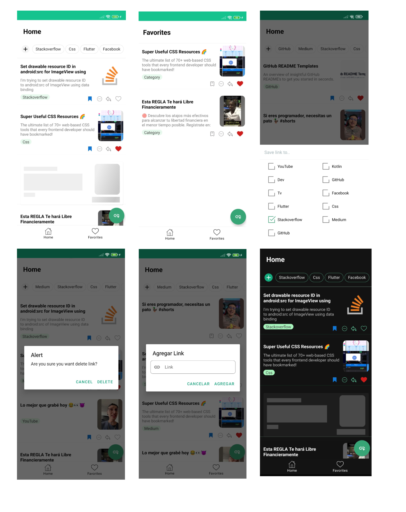

<h1 align="center">
   
  
   
  My links
   
</h1>

 App that allows us to save links from different web pages or social media in the same way to categorize each one according to our preference. This app implements the MVVM pattern and a clean architecture. 

### Libraries used :card_file_box:

